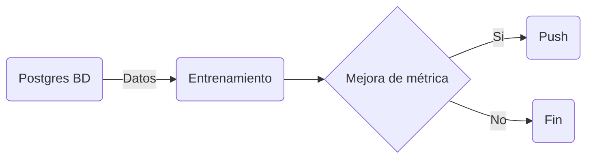
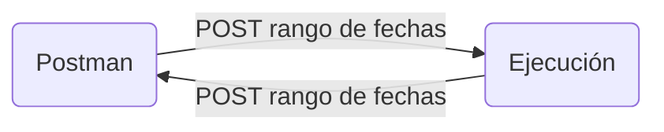

# fantastic-train

Se propone un infraestructura para entrenar modelos de Aprendizaje Automático



## Datos

- __Carga Inicial__

En la url que se utiliza existen datos desde enero de 2018 hasta el 30 de junio de 2024.
Para simular las carfgas incrementales posteriores se realiza una carga inicial del 1 de 
enero de 2018 al 30 de junio de 2023. La tabla se ubica en Postgres. 

- __Carga Incremental__

Para simular la carga incremental se incñuye método con rango de fechas. En este modelo lo 
natural sería que la carga fuera diaria, por lo que que el scheduler tendría un cron por ejemplo:

```bash 
0 0 * * *
```
La tabla aunque se ubique en Postgres se considera dejar el servicio como puerto para que se puedan
implementar adaptadores como conectores de Spark y Hive. Este modelo en un principio no necesita
motores de procesamiento distribuido.

- __Datos de ejecución__

Se incluye un simulador que proporciona el dataframe de entrada del modelo con fechas selccionables.


- __Datos de control__

Para analizar la calidad del modelo y posibles desvíos se requiere de un servicio que compara los registros
de las predicciones con los registros reales que se van volcando de forma incremental. La idea es establecer
algunos criterios de control, por ejemplo comparar medias de los datos en distintos intervalos de tiempo y 
desvíos de RMSE para enviar alarmas.

## Entrenamiento del modelo

Considerando la frecuencia de nuevos registros en este modelo se considera suficiente un entrenamiento cada
15 días, un ejemplo para el scheduler:

```bash
0 0 15 * * 
```

## Ejecución del modelo

Se propone un aplicación en en la que se toma la última versión del modelo y se ejecuta por el usuario a modo
de demo. Se puede ejcutar desde Postan.
